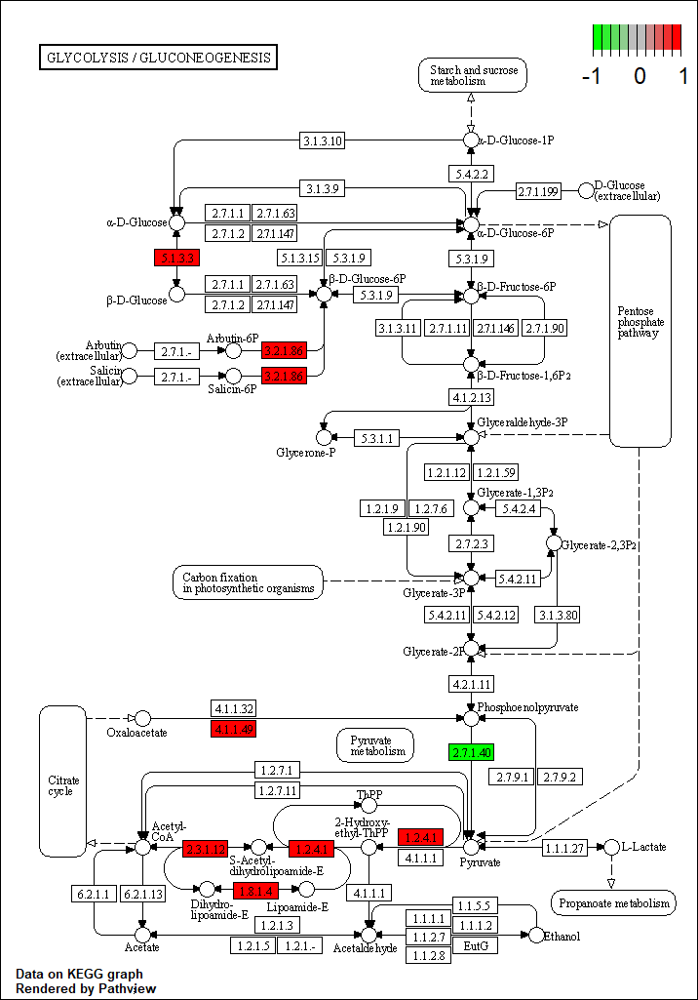
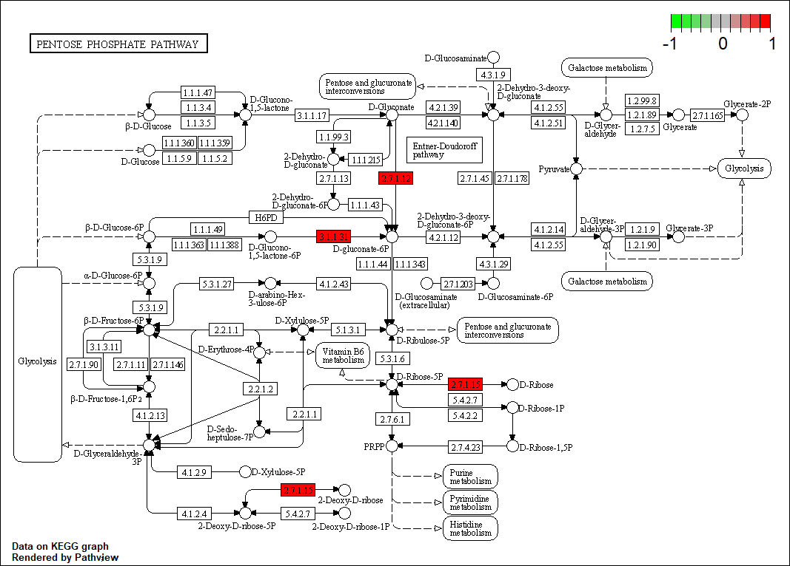
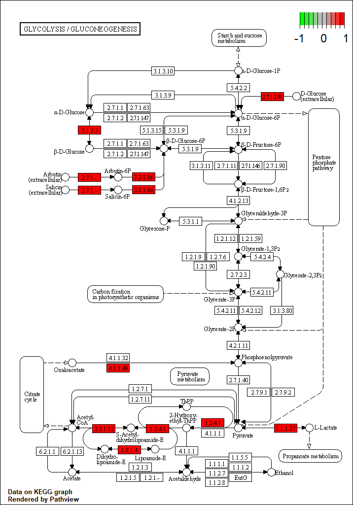
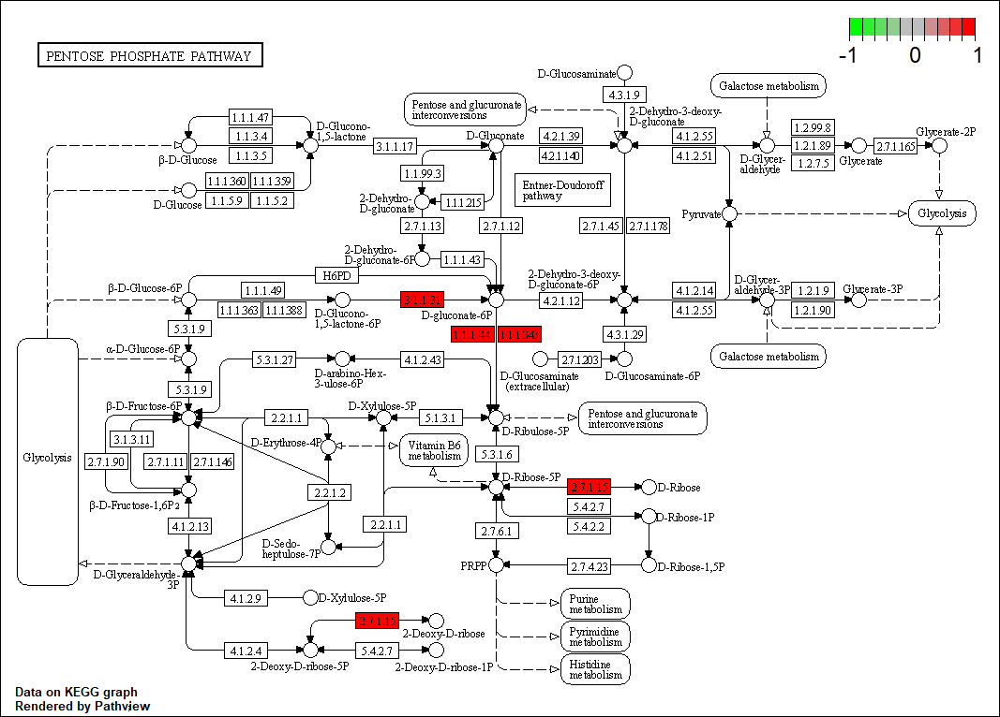

```{r setup, include=FALSE}
knitr::opts_chunk$set(echo = TRUE)
# load all required libraries
libraries = c("here", "edgeR", "dplyr", "xlsx", "pathview", "limma")
require(libraries)
lapply(libraries, require, character.only = TRUE)

# note that the RMarkdown library is also required, and that some of the above mentioned libraries were installed by using other libraries: BiocManager and DESeq2
```

<br> <!-- voor een extra witregel -->

## Loading the dataset
Als eerst moet het bestand in R worden ingelezen. Dit is gedaan met behulp van de library `here`, die de current working directory met `here()` ophaald, en vervolgens wordt dit samengeplakt met een opgegeven bestandsnaam. Van de data in het bestand is vervolgens een data frame gemaakt met `read.table()`. De identifiers voor de rijen (`row.names`) zijn de gennamen, die in rij 1 van het bestand staan.
``` {r create data frame, message = FALSE, warning = FALSE}

file_name = paste(here(), "RNA-Seq-counts.txt", sep = "/")
data_frame = read.table(file = file_name, sep = "\t", header = TRUE, row.names = 1)
```

Sample van hoe de data frame eruit ziet (alleen de eerste 10 regels):
```{r show data frame, echo=FALSE}
options(width = 100) # zodat alle kolommen op dezelfe line kunnen
head(data_frame, 10)
```

Om makkelijk met de count data te kunnen werken, wordt er van de data frame een DGEList object gemaakt. `DGEList()` is een functie van de `edgeR` library. Voor een DGEList moet de counts data (vanuit de dataset) en de groups (de verschillende samples) worden opgegeven:
```{r factor for DGEList}
exp = c("WCFS1.glc","WCFS1.glc","WCFS1.rib","WCFS1.rib", "NC8.glc", "NC8.glc", "NC8.rib", "NC8.rib")
group = factor(exp)
```

Vervolgens kan het DGEList object aangemaakt worden. Voor de `counts` parameter moeten de counts vanuit de data frame geselecteerd worden. De `group` parameter is de eerder aangemaakte group factor.
```{r create DGEList}
y <- DGEList(counts=data_frame[,1:8], group=group)
```

Het printen van de DGEList leverd het volgende resultaat:
```{r show DGEList, echo=FALSE}
y
```

<br>

## Normalize the data
Zodat de data met elkaar vergeleken kan worden, moet de data genormaliseerd worden. Hierdoor wordt bijvoorbeeld het effect van biologischefactoren die buiten je macht om de data beïnvloeden geminimaliseerd.

Er zijn verschillende manieren om data te normaliseren. Eén van deze manieren is de Trimmed Mean Method (TMM). De TMM methode is een normalisatie methode waarbij het gemiddelde pas wordt berekend, nadat een bepaalde hoeveelheid van de laagste en hoogste waarden van de dataset zijn verwijderd. De hoeveelheid waarden die van beide kanten worden weggegooid kunnen absolute aantallen zijn of percentages, vaak dezelfde hoeveelheid voor beide kanten. 

Nadat deze outliers van de dataset zijn verwijderd, wordt de trimmed mean bepaald aan de hand van een formule. De trimmed mean wordt gebruikt omdat het uitschieters niet mee neemt in de berekeningen, die anders de data op een negatieve manier zouden beïnvloeden. Bovendien wordt door het uitsluiten van de uitschieters een beter beeld van de werkelijkheid verkregen. 

De trimmed mean, en andere metingen en waarden, geven een basis voor de vergelijking van de data.

In R kan de trimmed mean normalisatie methode worden uitgevoerd met `calcNormFactors()`, een functie van de `edgeR` library:
```{r normalize data}
y <- calcNormFactors(y, method="TMM")
y
```
Alleen tijdens de berekening van de normalisatiefactoren worden de kleinste en hoogste waarde tijdelijk niet meegenomen, maar deze waarden blijven wel gewoon in het DGEList data object zitten. Wanneer er vervolgens verdere berekeningen worden gedaan met de dataset, zitten de kleinste en hoogste waarden hier dus gewoon weer bij. De vermeningvuldiging van counts met normalisatiefactor vindt automatisch plaats wanneer er met het data object gerekend wordt. 

Vervolgens wordt er een design matrix gemaakt, die data aan elkaar linkt. Een design matrix is "a matrix of values of explanatory variables of a set of objects. Each row represents an individual object, with the successive columns corresponding to the variables and their specific values for that object" (via https://en.wikipedia.org/wiki/Design_matrix). In R kan er een design matrix worden gemaakt met de `model.matrix()` functie. Het object waarover de design matrix moet worden gemaakt wordt opgegeven als de eerste parameter. De data vanuit de data frame die gelinkt moet worden aan het object wordt met de `data` parameter opgegeven. De kolommen van de design matrix krijgen een naam met de `colnames()` functie.
```{r design matrix}
design <- model.matrix(~0+group, data=y$samples)
colnames(design) <- levels(y$samples$group)
```

De design matrix ziet er als volgt uit:
```{r view design matrix, echo=FALSE}
design
```

Na de normalisatie kan er nog gefilterd worden op low read counts. Soms hebben genen zulke lage read counts dat ze niet significant genoeg zijn om als een verschil in genexpressie level te zien. Deze genen kunnen er dan uitgefilterd worden.De `edgeR` library heeft hier een functie voor: `filterByExpr`. Als parameters worden het DGEList object, de design matrix en een count threshold meegegeven. De `min.total.count` parameter geeft de threshold aan van het aantal read counts die één hele rij in de data frame moet hebben (dus over 8 kolommen). 1000 / 8 = 125 read counts moet elke kolom gemiddeld hebben, om significant te zijn. Met de niet gebruikte `min.count` parameter kan de threshold per kolom worden bepaald. Hiervoor is niet gekozen, omdat wanneer de ene stam bijvoorbeeld wel significant is, en de andere stam niet, dan blijven alleen de genen van één stam in de data zitten, waardoor je niet meer tussen de stammen kunt vergelijken.
```{r filter for low read counts}
keep = filterByExpr(y, design, min.total.count = 1000)
y = y[keep,]
summary(keep) # 302 genen van de 2219 worden eruit gefilterd (~13%)
```
<br>

## Calculate the dispersion
Om de spreiding tussen de data te bepalen, moet de dispersie worden berekent. Hiervoor zijn er verschillende functies beschikbaar in de `edgeR` library. Om zoveel mogelijk informatie te verkrijgen, worden er meerdere grafieken in dezelfde figuur geplot. Dit zijn de volgende grafieken:

1. De tagwise dispersie grafiek, waarbij elk datapunt één gen voor stelt.
2. De common dispersie grafiek, die een gemiddelde weer geeft van alle data, en daardoor constant is.
3. De trend dispersie grafiek, die een trendlijn trekt door de tagwise datapunten.

Er zijn 2 methodes om deze grafieken te maken. De methode gebruikt in dit onderzoek is de `estimateDisp()` functie, die alle grafieken in één keer plot. Hiervoor heeft de functie het DGEList object en de design matrix nodig:
```{r calculate dispersion}
y = estimateDisp(y, design)
```

De andere methode om de dispersie te bepalen is wel getest, maar niet in het uiteindelijke onderzoek gebruikt.

De dispersie kan als volgt worden geplot:
```{r dispersion plot}
correctplot = plotBCV(y)
title("BCV plot of the DGEList")
```

In de figuur is bijvoorbeeld te zien dat de variatie afneemt, naarmate de counts toenemen.

Ook kan nu de correlatie worden bepaald tussen de duplo's onderling, en over de verschillende condities en de _L. plantarum_ stammen. Dit kan in een PCA plot worden geplot:
```{r correlation plot}
plotMDS(y)
```

In deze grafiek kan op de eerste dimensie (x-as) afgelezen worden hoever de glucose en ribose groepen uit elkaar liggen. Op de tweede dimensie (y-as) kan afgelezen worden hoever de stammen en duplo metingen uit elkaar liggen. Het verschil tussen de duplo metingen moet klein zijn; was dit verschil groot geweest, dan betekent dat dat de condities tijdens de twee duplo metingen niet gelijk waren, wat ongwild is. Het verschil tussen de stammen mag logischerwijs wel groter zijn, dit geldt ook voor het verschil tussen de glucose en ribose condities.

In de figuur is te zien dat bij beide _L. plantarum_ stammen de glucose en ribose metingen wat verder uit elkaar liggen (een afstand van ongeveer 2). In de tweede dimensie is te zien dat de twee stammen onderling ook ongeveer 2 uit elkaar liggen. Verder is er te zien dat er weinig verschil is tussen de duplo metingen, doordat de datapunten van de duplo metingen elkaar overlappen.

<br>

## Calculate fold changes
Om verschil tussen genexpressie te bepalen, worden de fold changes van de genexpressie levels berekend. Ook worden hiervoor p-values berekent, om betrouwbaarheid te controleren. Hiervoor moet er eerst een model worden gefit voor de read counts van elk gen. Dit wordt gedaan met `glmFit`, een functie van `edgeR`. Daarna kan het contrast tussen de verschillende groepen worden bepaald met de `makeContrasts` functie van de library `limma` (die tegelijk met `edgeR` wordt ingeladen). Wanneer dat is gedaan, wordt er opniew een model gefit met de `glmLRT` functie, ook van `edgeR`. Omdat bij de `makeContrasts` functie maar twee groepen tegelijk met elkaar vergeleken kunnen worden, moeten deze stappen twee keer worden uitgevoerd: één keer voor het verschil in genexpressie van de verschillende voedingsbodems voor de WCFS1 stam en één keer hetzelfde voor de NC8 stam. 

Als eerst voor de WCFS1 stam:
```{r calculate fold changes WCFS1}
fit = glmFit(y, design)
mc = makeContrasts(exp.r=WCFS1.rib-WCFS1.glc, levels=design) 
fit = glmLRT(fit, contrast=mc)
wcfs1 = topTags(fit, n = nrow(fit))
```

De genen met het grootste verschil in fold changes (en dus expressie) tussen een ribose en glucose voedingsbodem van de WCFS1 stam kunnen dan worden weergegeven met `topTags`, dat defalut filtert op p-value:
```{r display top tags WCFS1}
print(topTags(fit))
```

De Fold Change waarden kunnen ook voor elk gen gevisualiseerd worden in een plot:
```{r plot FC WCFS1}
plot(fit$table$logFC, main = "Fold Changes per gene visualized for the WCFS1 strain", xlab = "Gene #", ylab = "Fold Change value")
# text(0:nrow(fit$table), fit$table$logFC, labels = row.names(fit$table)) # dit zet de namen van de genen op de dataputnen, maar het is niet heel overzichtelijk, dus daarom is het uitgecommend
```

En vervolgens voor de NC8 stam:
```{r calculate fold changes NC8}
fit = glmFit(y, design)
mc = makeContrasts(exp.r=NC8.rib-NC8.glc, levels=design) 
fit = glmLRT(fit, contrast=mc)
nc8 = topTags(fit, n = nrow(fit))
```

De topTags voor de NC8 stam:
```{r display top tags NC8}
print(topTags(fit))
```

En ook voor de NC8 stam worden de Fold Changes geplot:
```{r plot FC NC8}
plot(fit$table$logFC, main = "Fold Changes per gene visualized for the NC8 strain", xlab = "Gene #", ylab = "Fold Change value")
# text(0:nrow(fit$table), fit$table$logFC, labels = row.names(fit$table)) # ook weer om de gennamen erbij te plotten
```

Desondanks dat er in de PCA plot te zien was dat de de WCFS1 en NC8 stammen best wat uitelkaar lagen, lijkt er toch weinig verschil te zitten tussen de twee stammen in de genen die van expressie niveau veranderen.

<br>

## Cluster genes
Er zijn verschillende manieren om de genen te clusteren. De methode die gebruikt is in dit onderzoek is een hiërarchische cluster methode, die de verschillende samples in een boomstructuur kan clusteren. Hiervoor is de functie `hclust()` gebruikt. Deze functie heeft een afstandsmatrix nodig, om een hiërarchische structuur te maken. Dit kan worden aangemaakt met de `dist()` functie. Om ervoor te zorgen dat de condities en stammen gegproepeerd worden, en niet alle genen apart, moeten de rijen en kolommen van de counts matrix van het DGEList object worden omgewisseld, met de `t()` functie.
```{r hclust}
distances = dist(t(y$counts))
plot(hclust(distances))
```

Een andere clusteringsmethode is `kmeans()`. Deze methode is getest, maar is niet in het uiteindelijke onderzoek gebruikt.

<br>

## Results
Nu alle berekeningen gedaan zijn, kunnen er genen geselecteerd worden die aan bepaalde thresholds voldoen om verder onderzoek naar te doen, en ze in metabole pathways te plaatsen. De thresholds zijn een logFC value van hoger dan 1, of lager dan -1, en een FDR die kleiner is dan 0.05. Omdat de FDR waarden niet weergegeven worden in de fit variabelen van de twee stammen, maar wel met de `topTags()` functie, werden er bij de "Calculate fold changes" stap twee nieuwe objecten aangemaakt, waarin alle genen met behulp van de `topTags()` functie werden opgeslagen, zodat de FDR waarden bij dat object in zat. Vervolgens kan er op logFC en FDR gefiltert worden, wat met behulp van de functie `filter()` van de library `dpylr` was gedaan.
```{r results, warning=FALSE, message=FALSE}
# filter WCFS1 op logFC en False Discovery Rate (FDR)
wcfs1 = dplyr::filter(wcfs1$table, (wcfs1$table$logFC > 1 | wcfs1$table$logFC < -1) & wcfs1$table$FDR < 0.05)

# filter NC8 op logFC en FDR
nc8 = dplyr::filter(nc8$table, (nc8$table$logFC > 1 | nc8$table$logFC < -1) & nc8$table$FDR < 0.05)

# aantal signifcante genen per stam:
nrow(wcfs1)
nrow(nc8)
```
De filtering is voor beide stammen apart gedaan. Dit resulteerde in 296 signifcante genen in de WCFS1 stam en 
365 significante genen in de NC8 stam.

Om de genen verder te onderzoeken, moeten de genen van annotatie worden voorzien. Deze annotatie van (bijna) elk gen was te vinden in het WCFS1_anno.tsv bestand, en is ingelezen met de `read.delim()` functie om er een data frame van te maken. Omdat er tijdens het inlezen van het annotatie bestand door een onbekende reden er teveel kolommen werden aangemaakt, werd de ontstane data frame nog een keer gesubset, zodat deze kolommen uit de data frame werden gehaald. Vervolgens zijn de data frames van beide stammen apart met het annotatie data frame samengevoegd met de `cbind()` functie, om de genen van annotatie te voorzien.
```{r merge with annotation}
# create annotation data frame
anno_frame = read.delim(paste(here(), "WCFS1_anno.tsv", sep = "/"), header=TRUE, row.names = 1)
anno_frame = anno_frame[, 1:9]

# Merge data frames with annotation
combined_wcfs1 = cbind(wcfs1, anno_frame[rownames(wcfs1), ])

combined_nc8 = cbind(nc8, anno_frame[rownames(nc8), ])
```

Zodat de data makkelijker te lezen is, worden de twee data frames weggeschreven naar een .xlsx bestand. Dit wordt gedaan met de `write.xlsx()` functie van de `xlsx` library.
```{r write results}
# ler er op dat dit een error geeft als het bestand al bestaat, dus daarom staan ze nu uit gecommend
# write.xlsx(combined_wcfs1, paste(here(), "results.xlsx", sep = "/"), sheetName = "wcfs1_results", append = TRUE)
# write.xlsx(combined_nc8, paste(here(), "results.xlsx", sep = "/"), sheetName = "nc8_results", append = TRUE)
```

<br>

## KEGG Mapper
Om te kijken in welke pathways de significante genen van beide stammen een rol hebben, worden de genen op meerdere verschillende pathways gemapped. Dit is uitgevoerd met de `pathview()` fucntie van de `pathview` library. Dit wordt voor beide stammen apart gedaan. De pathways waarom de genen zijn gemapped zijn de volgende pathways:

* Glycolyse/gluconeogenesis pathway
* Pyruvate metabolism pathway
* Pentose phosphate pathway
* Purine metabolism pathway
* Pyrimidine metabolism pathway
* Een overall pathway met alle pathways samen

Alleen de glycolyse/gluconeogenesis en pentose phosphate pathways worden voor beide stammen afgebeeld.

Voor de WCFS1 stam:
```{r keggmapper WCFS1, message=FALSE}
genes <- row.names(combined_wcfs1)
logFC <- combined_wcfs1$logFC
names(logFC) <- genes

pathview(gene.data = logFC, species = "lpl", pathway = "lpl00010",  gene.idtype = "KEGG", out.suffix = "wcfs1")
pathview(gene.data = logFC, species = "lpl", pathway = "lpl00030", gene.idtype = "KEGG", out.suffix = "wcfs1")
#pathview(gene.data = logFC, species = "lpl", pathway = "lpl00230", gene.idtype = "KEGG", out.suffix = "wcfs1")
#pathview(gene.data = logFC, species = "lpl", pathway = "lpl00240", gene.idtype = "KEGG", out.suffix = "wcfs1")
#pathview(gene.data = logFC, species = "lpl", pathway = "lpl00620", gene.idtype = "KEGG", out.suffix = "wcfs1")
#pathview(gene.data = logFC, species = "lpl", pathway = "lpl01100", gene.idtype = "KEGG", out.suffix = "allpathwaysWCFS1")
```



<br>



Voor de NC8 stam:
```{r keggmapper NC8, message=FALSE}
genes <- row.names(combined_nc8)
logFC <- combined_nc8$logFC
names(logFC) <- genes

pathview(gene.data = logFC, species = "lpl", pathway = "lpl00010",  gene.idtype = "KEGG", out.suffix = "nc8")
pathview(gene.data = logFC, species = "lpl", pathway = "lpl00030",  gene.idtype = "KEGG", out.suffix = "nc8")
#pathview(gene.data = logFC, species = "lpl", pathway = "lpl00230", gene.idtype = "KEGG", out.suffix = "nc8")
#pathview(gene.data = logFC, species = "lpl", pathway = "lpl00240", gene.idtype = "KEGG", out.suffix = "nc8")
#pathview(gene.data = logFC, species = "lpl", pathway = "lpl00620", gene.idtype = "KEGG", out.suffix = "nc8")
#pathview(gene.data = logFC, species = "lpl", pathway = "lpl01100", gene.idtype = "KEGG", out.suffix = "allpathwaysNC8")
```




<br>



<br>

## Research Report
Voor een volledige, uitgebreide beschrijving van de materiaal en methode, de resultaten, en de interpretatie van de resultaten, zie het research report.

<a href="#top">Back to top</a>

<br>
